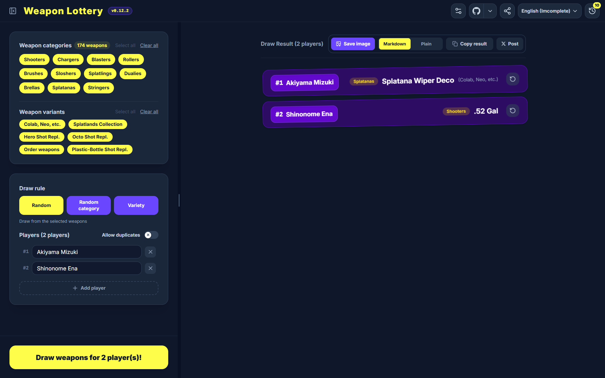
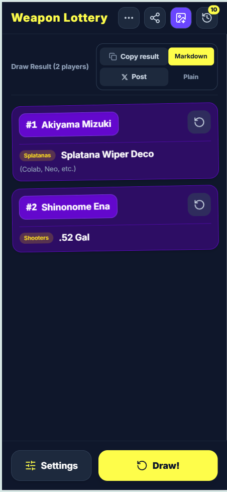

  

<h1 align="center">ブキみくじ Weapon Lottery</h1>

  <b>A web app for drawing weapons from Splatoon 3</b>

  <a href="#demo">Demo</a>・
  <a href="#features">Features</a>・
  <a href="#how-to-use">How to Use</a>・
  <a href="#history">History</a>・
  <a href="#copy-post-and-share-results">Share Result</a>・
  <a href="#advanced-settings">Advanced Settings</a>・
  <a href="#supported-environments">Supported Environments</a>・
  <a href="#contributing">Contributing</a>

  🌐 <a href="README">日本語</a>・English

  
  
  
  
  

  
  
  

---

## Demo

  <h3 align="center">🔗 <b><a href="https://spla3-lottery-weapon.pages.dev/">Open the app (CF Pages)</a></b></h3>

  <h3 align="center">Overview</h3>
  

  <h3 align="center">Drawing animation</h3>
  

## Features

- 🎲 Draw **weapons for multiple players** at once

- ♻️ **Redraw** weapons for individual players

- 🚫 **Exclude weapons** from the draw

- 🔍 Filter weapons by **category / variant**

- 📜 **Three drawing rules**
  - 🎲 **Random**: Draw weapons randomly
  - 🔍 **Weapon category**: Draw one weapon category, then draw each player's weapon from that category
  - 🔫 **Variety weapons**: Draw weapons so that every player gets a different weapon category

- 🎬 **Drawing animation**: Can be enabled or disabled, with optional sound

- ↩️ **Drawing history**: Saves the conditions and results of the last 10 draws

- 👥 **Player list templates**: Save teams you often play with

- 🔗 **Share drawing conditions and results via URL**

- 💾 **Save drawing results as images**

- 📋️ **Copy results as Markdown or plain text**

- 🌐 **Japanese / English** support

- 🎛️ **PWA** support

## How to Use

> [!NOTE]
> The layout changes depending on whether you access the app from a PC or a smartphone.
> <figure>
>   
>   <figcaption align="center"><em>PC version</em></figcaption>
> </figure>
> <figure>
>   
>   <figcaption align="left"><em>Smartphone version</em></figcaption>
> </figure>

1. Open the **[app](https://spla3-lottery-weapon.pages.dev/)**.

2. **PC:** Choose the drawing conditions from the menu on the left.\
   **Smartphone:** Choose the drawing conditions from the displayed screen.

3. Press `Draw weapons for N players!` to draw weapons.

> [!TIP]
> On PC, you can press Enter to draw when no button is focused.

4. Press `Draw weapons for N players!` / `Draw!` again to redraw.

5. **PC:** Change the drawing conditions from the menu on the left to redraw with different conditions.\
   **Smartphone:** Press `Settings` in the bottom-left to open the drawing condition menu, then change the conditions and redraw.

> [!NOTE]
> Press the button (↓) on the right side of a result to redraw the weapon for an individual player.
> <figure>
>    
>    <figcaption align="left"><em>Redraw button</em></figcaption>
> </figure>

## History

Press the **History button** in the top-right corner to open the history menu.

> [!TIP]
> The number displayed at the top-right of the History button shows the number of saved history entries.

<figure>
   
   <figcaption align="left"><em>History button</em></figcaption>
</figure>

Select a history entry to restore its **drawing conditions and results** and draw again.\
Up to **10 entries** are saved in the history.

## Copy, Post, and Share Results

From the share area above the drawing results, you can:

- Save the results as an image

- Copy the results as text (Markdown / plain text)

- Post the results to X (formerly Twitter)

<figure>
   
   <figcaption align="left"><em>Share area</em></figcaption>
</figure>

> [!NOTE]
> On the smartphone version, you can save the results as an image using the button (↓) at the top.
> <figure>
>    
>    <figcaption align="left"><em>Download button on smartphone</em></figcaption>
> </figure>

> [!TIP]
> Copying the results as Markdown makes them easier to read when pasted into Discord or similar services.
> <figure>
>    
>    <figcaption align="left"><em>Example of Markdown results pasted into Discord</em></figcaption>
> </figure>

When you save the results as an image, an image like the following will be saved.

<figure>
   
   <figcaption align="left"><em>Saved result image</em></figcaption>
</figure>

You can also copy/share a link for **sharing the drawing conditions and results** from the share menu at the top.

<figure>
   
   <figcaption align="left"><em>Share button</em></figcaption>
</figure>

## Advanced Settings

Press the settings button (↓) at the top to open the advanced settings.

<figure>
   
   <figcaption align="left"><em>Advanced settings button</em></figcaption>
</figure>

### Settings

#### Excluded Weapons

- Click a weapon name to exclude that weapon from the draw.

- Press `Clear all exclusions` to clear all excluded weapons.

#### Player List

| Setting | Description |
|----|----|
|Save player list in browser|When enabled, the players from the most recent draw are saved in the browser and automatically shown the next time you open the app.|

#### Player Templates

- You can save the current player list as a template.

- Enter a template name and press the save button on the right. The saved template will then appear below.

#### Drawing Animation

| Setting | Description |
|----|----|
|Enable drawing animation|When enabled, an animation is played when drawing weapons.|
|Play drawing animation sound|When enabled, sound is played during the animation.|
|Volume|Adjusts the volume of the drawing animation sound. This setting is shown when `Play drawing animation sound` is enabled.|
|Animation length|Adjusts the length of the animation.|

## Supported Environments

※ Only environments that have been tested are listed.\
※ All software was updated to the latest version at the time of testing.

### PC (Windows 11 26H2 (26300.9550))
- [x] Google Chrome

- [x] Microsoft Edge

### Smartphone (Android 17)
- [x] Google Chrome

### PC / Smartphone
- PWA (Progressive Web App)

> [!NOTE]
> With a PWA, you can access the app directly from your home screen, taskbar, etc.
> For instructions on how to install a PWA, [please check the relevant instructions as needed.](https://www.google.com/search?q=pwa+install+how+to)

## Contributing

If you have a feature request or would like to contribute to this app, feel free to let us know through **[Pull Requests](https://github.com/zibasan/spla3-lottery-weapon/pulls) or [Issues](https://github.com/zibasan/spla3-lottery-weapon/issues)**.\
For more information, please see **[CONTRIBUTING.md](CONTRIBUTING.md)**.

## Current Version

## License

[MIT License](LICENSE)

## Disclaimer

This is a fan-made application for drawing weapons from "Splatoon 3".\
It is not officially endorsed or approved by Nintendo Co., Ltd. or its affiliates.
