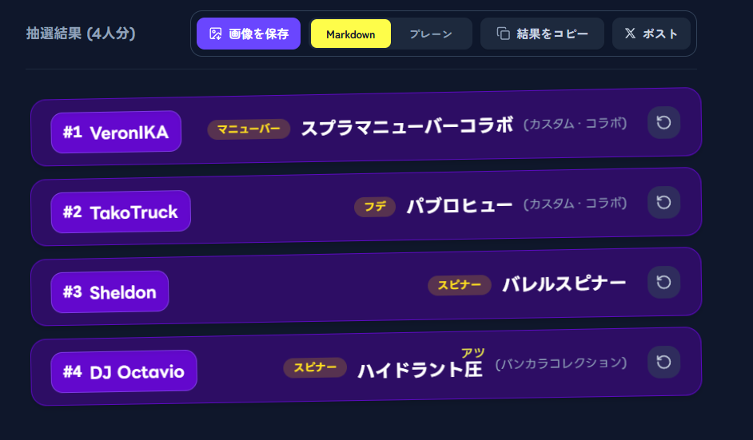
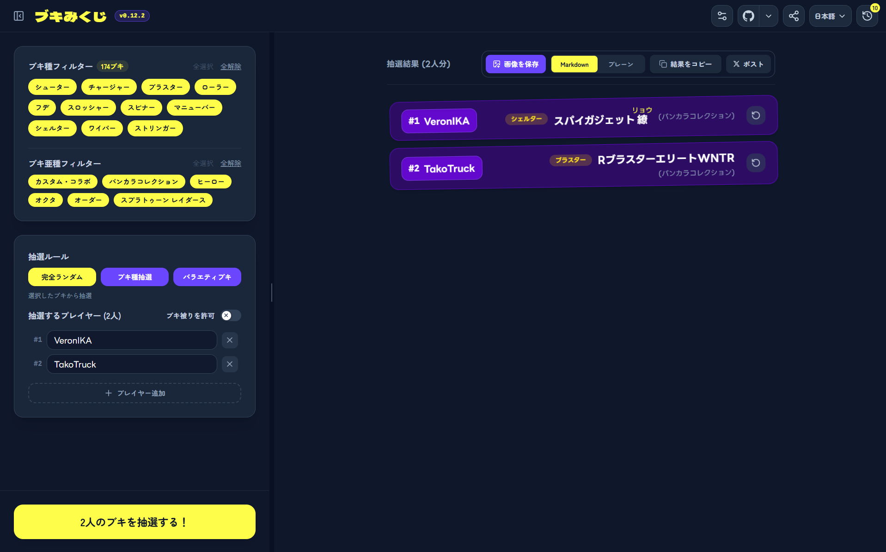
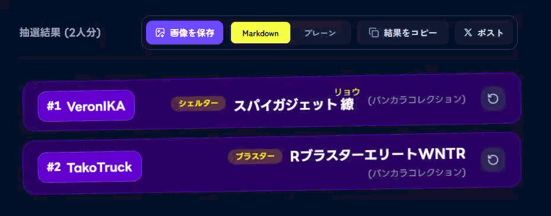
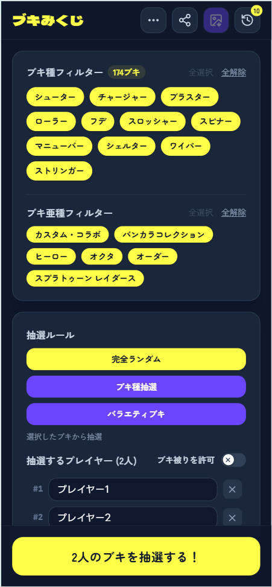
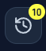
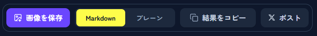
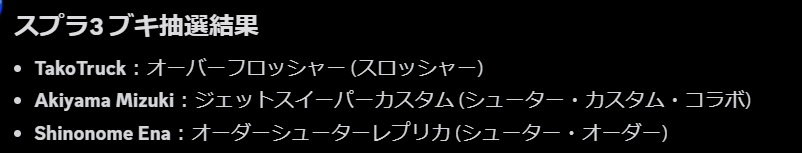
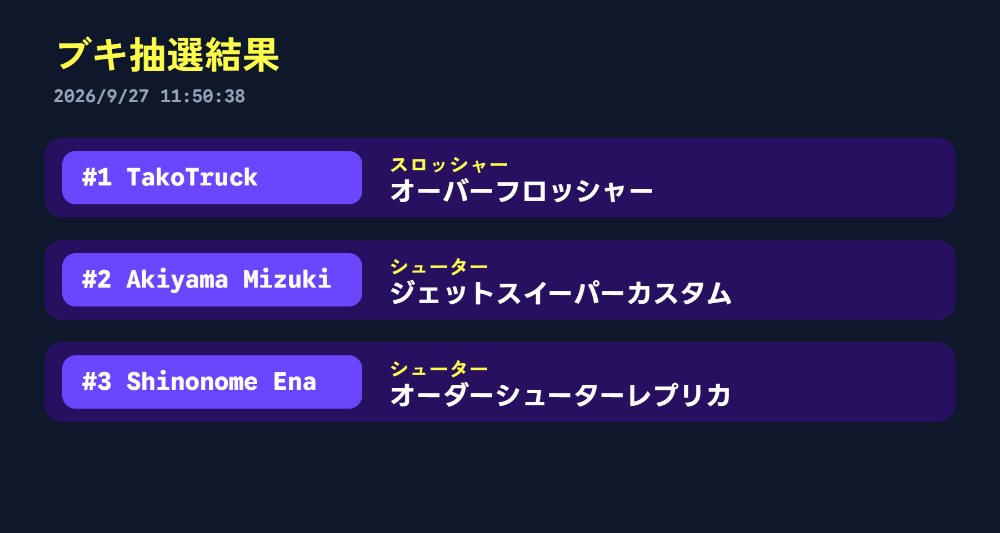
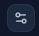

  

<h1 align="center">ブキみくじ Weapon Lottery</h1>

  <b>スプラトゥーン３のブキを抽選するWebアプリ</b>

  <a href="#デモ">デモ</a>・
  <a href="#主な機能">機能</a>・
  <a href="#使い方">使い方</a>・
  <a href="#履歴機能">履歴機能</a>・
  <a href="#結果のコピーポストと共有">結果の共有</a>・
  <a href="#詳細設定">詳細設定</a>・
  <a href="#動作環境">動作環境</a>・
  <a href="#バグ報告要望">バグ報告・要望</a>

  🌐 日本語・<a href="README.en.md">English</a>

  
  
  
  
  

  
  
  

---

## デモ

  <h3 align="center">🔗 <b><a href="https://spla3-lottery-weapon.pages.dev/">アプリはこちらから(CF Pages)</a></b></h3>

  <h3 align="center">全体のスクリーンショット</h3>
  

  <h3 align="center">抽選演出</h3>
  

## 主な機能

- 🎲 **複数のプレイヤーのブキ**をまとめて抽選

- ♻️ **各プレイヤー別**の再抽選

- 🚫 **抽選から除外するブキ**の指定

- 🔍️ **ブキのカテゴリ／亜種**で抽選するブキをフィルター

- 📜 **3つの抽選ルール**
  - 🎲 **ランダム**: ブキをランダムに抽選
  - 🔍️ **ブキ種抽選**: ブキのカテゴリを1つ抽選し、そのカテゴリの中からプレイヤーのブキを抽選
  - 🔫 **バラエティブキ**: 全員違うブキのカテゴリから抽選

- 🎬 **抽選演出**: オンオフの切替可能、サウンドの再生もできる

- ↩️ 直近10回の抽選条件と結果を保存する**抽選履歴**

- 👥 よく遊ぶチームを保存しておける**プレイヤーリストテンプレート**

- 🔗 URLによる**抽選条件や結果の共有**

- 💾 抽選結果を**画像として保存**

- 📋️ Markdownやプレーンテキストで**結果テキストをコピー**

- 🌐 **多言語(日本語/英語)対応**

- 🎛️ **PWA(サイトをアプリ化する仕組み)対応**

## 使い方

> [!NOTE]
> PCからアクセスしたときとスマホからアクセスしたときでレイアウトが変わります。
> <figure>
>   
>   <figcaption align="center"><em>PC版</em></figcaption>
> </figure>
> <figure>
>   
>   <figcaption align="left"><em>スマホ版</em></figcaption>
> </figure>

1. **[アプリ](https://spla3-lottery-weapon.pages.dev/)** にアクセスします。

2. **PC版**: 左側のメニューから抽選条件を決めてください。\
  **スマホ版**: 表示された画面から抽選条件を決めてください。

3. `◯人のブキを抽選する！`を押すとブキを抽選します。

> [!TIP]
> PC版は、どのボタンにもフォーカスが当たっていないときにEnterを押すと抽選できます。

4. 再度 `◯人のブキを抽選する！` / `抽選する！` を押すと再抽選できます。

5. **PC版**: 左側のメニューから抽選条件を変えることで、条件を変えて再抽選できます。\
  **スマホ版**: 左下の `設定` を押すと抽選条件を変えるメニューが開き、ここから条件を変えて再抽選できます。

> [!NOTE]
> 結果の右側にあるボタン(↓)を押すと、プレイヤー別に再抽選できます。
> <figure>
>    
>    <figcaption align="left"><em>再抽選ボタン</em></figcaption>
> </figure>

## 履歴機能

右上にある**履歴ボタン**を押すと履歴メニューが開きます。

> [!TIP]
> 履歴ボタンの右上にある数字は、履歴の件数を示します。

<figure>
   
   <figcaption align="left"><em>履歴ボタン</em></figcaption>
</figure>

各履歴を押すと、**抽選条件や抽選結果**を復元して再抽選できます。\
履歴は**最大10件まで**保存されます。

## 結果のコピー・ポストと共有

抽選結果の上にある共有エリアから、

- 結果を画像として保存

- 結果をテキストとしてコピー (Markdown/プレーンテキスト)

- 結果をX(旧Twitter)にポスト

の操作ができます。

<figure>
   
   <figcaption align="left"><em>共有エリア</em></figcaption>
</figure>

> [!NOTE]
> スマホ版は、上側にあるボタン(↓)から画像として保存できます。
> <figure>
>    
>    <figcaption align="left"><em>スマホ版のダウンロードボタン</em></figcaption>
> </figure>

> [!TIP]
> Markdownとして結果をコピーすると、Discordなどに貼り付けるときに見やすくなります。
> <figure>
>    
>    <figcaption align="left"><em>DiscordにMarkdown形式で貼り付けしたときのイメージ</em></figcaption>
> </figure>

結果を画像として保存すると、以下のような画像が保存されます。

<figure>
   
   <figcaption align="left"><em>保存される画像</em></figcaption>
</figure>

また、上側の共有メニューから**抽選条件や抽選結果**を共有するリンクをコピー/共有できます。

<figure>
   
   <figcaption align="left"><em>共有ボタン</em></figcaption>
</figure>

## 詳細設定

上側の設定ボタン(↓)を押すと詳細設定が開きます。

<figure>
   
   <figcaption align="left"><em>詳細設定ボタン</em></figcaption>
</figure>

### 設定一覧

#### 除外するブキ

- ブキ名をクリックすると、そのブキを抽選から除外します。

- `除外を全解除` を押すと、除外設定を全て解除します。

#### プレイヤーリスト

| 項目名 | 説明 |
|----|----|
|プレイヤーリストをブラウザに保存|オンにすると、最後に抽選したプレイヤーをブラウザに保存して、次にアプリを開いたときにそのプレイヤーが最初から表示されます。|

#### プレイヤーテンプレート

- 現在のプレイヤーリストをテンプレートとして保存できます。

- テンプレートの名前を入力して右側の保存ボタンを押すと、下に保存されたテンプレートが表示されます。

#### 抽選演出

| 項目名 | 説明 |
|----|----|
|抽選演出を有効にする|オンにすると、抽選時にアニメーションを再生します|
|抽選演出の音を鳴らす|オンにすると、演出中に音を鳴らします|
|音量|抽選演出の音の音量を調節します。 この項目は`音を鳴らす`がオンの時に表示されます|
|演出の長さ|抽選演出の長さを調節します|

## 動作環境

※実際に動作した環境のみを載せています。\
※ソフトはすべて最新版を使用しています。

### PC (Windows 11 26H2(26300.9550))
- [x] Google Chrome

- [x] Microsoft Edge

### スマホ (Android 17)
- [x] Google Chrome

### PC/スマホ
- PWA(Progressive Web Apps, サイトをアプリ化したようなもの)

> [!NOTE]
> PWAを使うと、ホーム画面やタスクバーなどから直接アプリにアクセスできます。
> PWAをインストールする方法は、[必要に応じてご確認ください。](https://www.google.com/search?q=pwa+%E3%82%A4%E3%83%B3%E3%82%B9%E3%83%88%E3%83%BC%E3%83%AB%E6%96%B9%E6%B3%95)

## バグ報告・要望

機能のリクエストや、このアプリに貢献してくれる方は、 **[Pull Request](https://github.com/zibasan/spla3-lottery-weapon/pulls) や [Issues](https://github.com/zibasan/spla3-lottery-weapon/issues)** でお気軽にお知らせください。\
くわしくは **[こちら](CONTRIBUTING.md)** をご覧ください。

## 現在のバージョン

## ライセンス

[MIT License](LICENSE)

## 免責事項

本アプリは、「スプラトゥーン3」のブキを抽選するファンメイドアプリです。\
任天堂株式会社およびその関連会社によって公式に承認されたものではありません。
